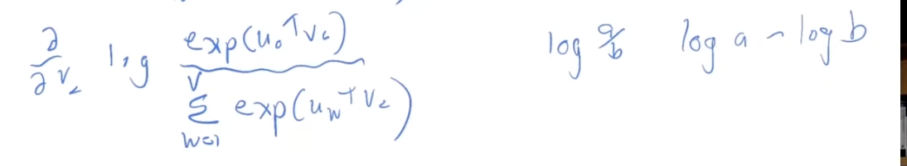

- by Christopher Manning - CS224N


- How human languages can be complex


- CS145 - Database Management Systems
- link to the course: https://web.stanford.edu/class/cs145/

- text to SQL


- we have a piece of text, here its `into`, and then we say , we have a model of predicting the probability of predicting the context words, given the center word, 

- we do the probability of the next word and its context too

- Overall model
    - for each position t=1..T , we want to predict the context words within a window of fixed size m, given the center word, 
    - want to become good at that
    - we want to high probability to the words that occur in the context
    - We are going to do Data likelihood, as to how good a job we are doing at predicting the words in the context of other words
    - formally likelihood is going to be defined in terms of a word vectors, so that the parameters of our model will be calculated by , taking each words as a center word and then the product of each word in a window around that  of the probability of the context words given the center word
    - to learn this model we need an objective function, which is going to be the log likelihood of the data, and we are going to maximize that
    - and we have to minimize the negative log likelihood, loss or cost function
    - we want to maximize the likelihood of the context we see around center words  
    - So we fiddle that, because sum is easier to work with than product, we take the log of the likelihood, and then we have the sum of the log of the probability of the context words given the center word
    - we get average log likelihood, and we want to maximize that

- we still havent done any progress in how do we calculate the probabilty of a word occuring in the  context, given the center word
- this is done by having the vector representation of each word , and workout the proobabilities simply in terms of the word vectors
- so each word has two vectors,
    - one when the word is used as a center word
    - one when the word is used as a context word
- this is done because it simplifies the math in the optimization
- Probability of context word appearing given the center word


- c - center word and o - context word
- we just take the vector of the center word and the vector of the context word and take the dot product of them , 
- dot product is a measure of similarity between two vectors
- https://youtu.be/rmVRLeJRkl4?list=PLoROMvodv4rMFqRtEuo6SGjY4XbRIVRd4&t=2086
- to get more insights on how the dot product is a measure of similarity between two vectors
- if two words have a large dot product, then they are similar
- Now lets see how to turn these into probability distributions
- firstly , we should not have negative probabilities, so we take the exponent of the dot product, so that we get a positive number always in the numerator
- also for probability distribution, we need to normalize the probabilities, so we divide by the sum of the exponent of the dot product of the center word and all the context words
- Softmax function will take , any Rn vector and turns it into a probability distribution, between 0 and 1, and the sum of the probabilities will be 1
- So we have a vector of probabilities, and we want to maximize the probability of the context words given the center word
- the name comes from the fact that we are going to maximize the probability of the context words given the center word, its sort of like a max, because of the fact that we exponentiate the dot product, that really emphasized the big content, in a different dimentions of calcualting the similarity, so most of the probability will go to the most similar things
- and its called soft because   , it doesnt do that absolutely, but it will still give some probability to everything , thats in slightest bit similar

- softmax is taking a set of numbers and scaling them , but is returning the whole probability distribution

- we want to fiddle the word vectors in such a way that we minimize the loss function    


- Take partial derivatives



- derivative of first part will give just Uo, as we are taking derivative with respect to Vc

- Denoinator is just a little complex
- its like f(g(x)) , so we need to use chain rule

- we need to remember how to use chain rule
- NOTE : derivative of log of something is 1/that something
- derivative of exp of something is exp of something, so we get the same thing back

- this is just the softmax we had earlier


- this is expectation
- this is an average of all the context vectors, weighted by the probaility according to the model
- its always the case with these softmax style models
- 

- the api.load('glove-wiki-gigaword-100') is a particular set of word vectors 
- golve word vectors that was made by stanford in 2014
- we are loading a 100d word vector, so that things run faster
- `model['bread']` will give the word vector for the word bread which will be a 100d vector
- `model['bread'].shape` will give the shape of the vector
- as bread and croissant are similar, we can see that the dot product of the two vectors is high 
- `model.most_similar(negative='banana')`
    - this will give the words that are most dissimilar to banana
```
result=model.most_similar(positive=['woman','king'],negative=['man'])
print("{}: {:.4f}".format(*result[0]))
```
```
def analogy(x1,x2,y1):
    result=model.most_similar(positive=[y1,x2],negative=[x1])
    return result[0][0]
``` 
- analogy task is to start with a word like king, subtract out a component like man and add back in woman component
    - what will the output be,it should be `queen`

```
analogy('man','king','woman')
analogy('king','man','queen')
```
- its not always perfect
```
analogy('australia','beer','france')
```
```
analogy('pencil','sketching','camera')
```
```
analogy('obama','clinton','reagan')
```
```
analogy('tall','tallest','long')
```
 

- try using this colab.
    - https://colab.research.google.com/drive/1_zJacC80aaOomzQMF5kICIObESSwOIwD#scrollTo=1xGrPYhT_V0i

- Distinctino between two vectors per word,
- if a word has two different meaning, then we will have two different vectors for that word
- `star` can be a movie star or a star in the sky, so we will have two different vectors for that
- `bank` can be a river bank or a financial bank, so we will have two different vectors for that
- `run` can be a verb or a noun, so we will have two different vectors for that

- https://www.youtube.com/playlist?list=PL3FW7Lu3i5Jsnh1rnUwq_TcylNr7EkRe6
    - the above video is for speech technology

- cs224 - Natural Language Understanding
    - https://www.youtube.com/playlist?list=PLoROMvodv4rObpMCir6rNNUlFAn56Js20

-  for this class we do , working with text and doing various kinds tasks like text analysis and undestanding, machine translation, Q and A, how to parse sentences, 
- Whethere you are predicting the context word or center word
    - we were doing the prediction of the context words, `Skip grand model`
        - skip grand with negative sampling