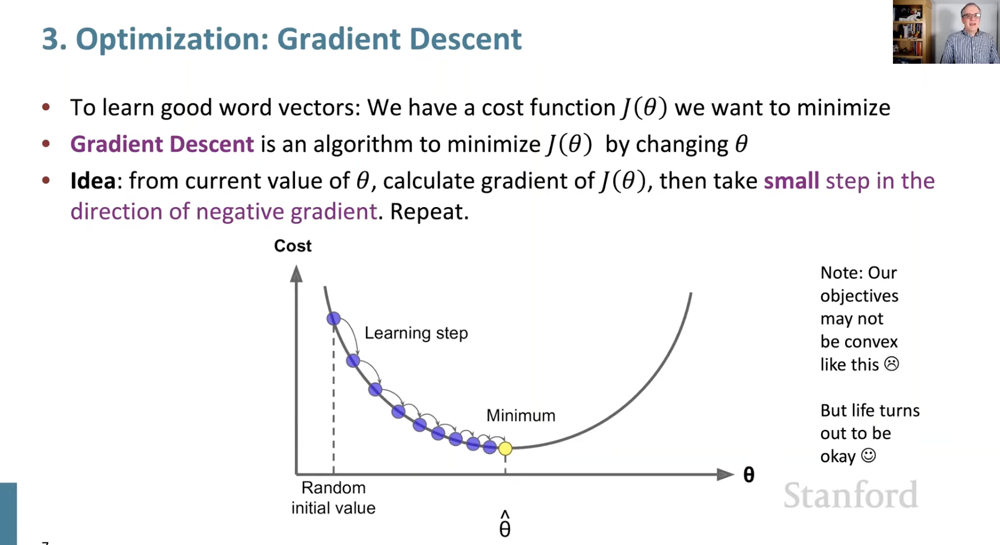
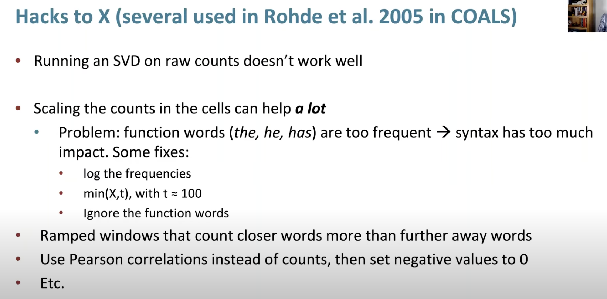
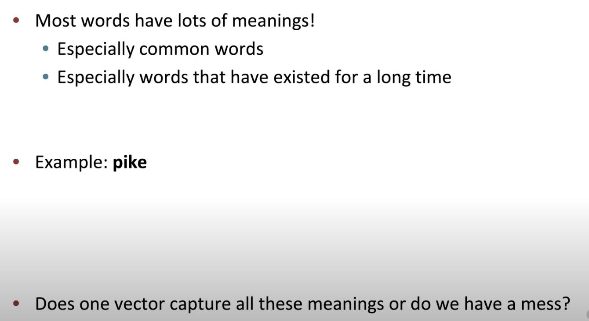

- word embeddings papers like 
    - google word to vec paper
        - https://code.google.com/archive/p/word2vec/
    - glove paper
    - Sanjeev Arora's paper

    
- Bag of words model, it wont pay attention to the next word, order or position, it doesnt matter
- the probability estimate would be the same
- even this model is quite good to learn quite a bit of properties of the model

    - tuesday, thursady,sunday are close
    - nokia , samsung are close
- how do we learn good word vectors

- NN in general is not convex

- in stochastic gradient descent , we take smal batch and perform gradient computation 

- cs25 Transformers https://www.youtube.com/watch?v=P127jhj-8-Y&list=PLoROMvodv4rNiJRchCzutFw5ItR_Z27CM

- word vectors are represented as rows

- two vwctors for each word type, 
    - centre vector
    - outside vector
- SKip gram model   
     - predict context word from given centre word
- Continuous Bag of Words
    - predict centre word from context words
- both give similar results
- SGNS -> skip gram negative Sampling

- naive softmax will be more expensive to calculate the denominator
- if we have 100,000 words, we need to do 100,000 dot products

- overall we want to optimize is   still an average of the loss for each particular center word, and each particular window, we going to take the dot product as before the center and the outside word
- now we are not using softmax, instead we are putting it into a logistic function, often called Sigmoid function
- What logistic does is , it converts any real number to a probability of 0 and 1 open interval, 
- so if the dot product is large, the logistic of the dot product will virtually be 1

https://youtu.be/gqaHkPEZAew?list=PLoROMvodv4rMFqRtEuo6SGjY4XbRIVRd4&t=1279
- unigram distribution of words
    - how often does each word occur in the corpus
- 3/4th power is used to make the distribution less skewed, so that the most frequent words are not too much more frequent than the least frequent words

- this is a symmetric matrix
- What is negative sampling?
    - we are going to take the center word and the context word, and we are going to say that we want to maximize the probability of the context word given the center word, and we are going to minimize the probability of the context word given the center word, for all the words that dont appear in the context
- why do we take only one negative sample?
    - because we are going to do this for every center word, and every context word, so we are going to have a lot of negative samples
    - so we dont need to take a lot of negative samples
- in softmax , we have to calculate the probability of the context word given the center word, for all the words in the vocabulary, we do that by taking the dot product of the center word and the context word, and then we exponentiate that, and then we normalize it by the sum of the exponentiated dot products of the center word and all the context words
- negative sampling is trying to do the same thing, but instead of doing it for all the words in the vocabulary, we are going to do it for the context word, and one negative sample
- co occurence matrix will give , how often does each word occur with each other word
- Are these kind of count word vectors good to use?
    - they are not good to use, because they are very sparse, and they are very high dimensional
    - they are very high dimensional, because the number of words in the vocabulary is very large
    - they are very sparse, because most words dont occur with most other words

- SVD is a way of taking a matrix and decomposing it into a product of three matrices
- SVD has various applications in machine learning like 
    - dimensionality reduction
    - matrix completion
    - collaborative filtering
    - latent semantic analysis
    - word embeddings
    - topic modeling
    - etc
- U , diagonal matrix and V transpose are the three matrices
- this works for any shape

- what is glove model?
    - it is a model that is trained to predict the co occurence of words
    - it is trained to predict the probability of word j appearing in the context of word i , given the vector representation of word i and word j

